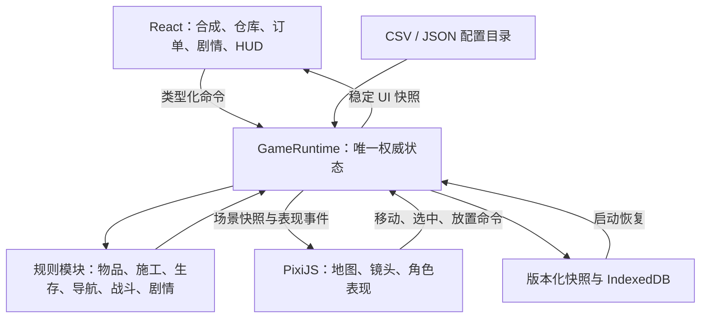

# WordMerge 技术实现方案

日期：2026-09-29。用户已确认首个可玩版本优先手机浏览器 H5；本文件给出本轮技术选型和可执行的实施基线。规则依据 [策划共识](design/CORE-RULES.md) 与 [夜袭工作稿](design/NIGHT-DEFENSE-DISCUSSION.md)，不把待试玩数值描述成最终平衡值。

**实施进度：M1 地图、M2 合成 / 体力 / 本机存档、M3 建造、M4 生存与守卫闭环、M5 首章剧情 / 探索 / 装扮原型已完成，详见 [M1](implementation/M1-MAP.md)、[M2](implementation/M2-PRODUCTION-SAVE.md)、[M3](implementation/M3-CONSTRUCTION.md)、[M4](implementation/M4-SURVIVAL-DEFENSE.md)及 [M5 开发记录](implementation/M5-STORY-EXPLORATION-DECOR.md)。三天供需脚本已跑通，真机性能与长时间稳定性尚未验收，不能按下文目标推定所有能力已经存在。M3 蓝图、M4 生存参数与 M5 内容暂用随构建发布的 TypeScript 结构目录，外置 JSON / CSV 为后续演进。**

## 1. 技术路线与范围

2026-10-06 经济扩展已接入现有 Runtime：`economy.ts` / `economyConfig.ts` / `economyValidation.ts` 管理资源清理、商店与额外行动消耗；沿用 `inventory.gold/gems`，精力仍用内部 `stamina` 字段。schema 4 增补经济状态并显式迁移工具目录指纹，派生 WorldMap 移除已清理物体；无独立背包或 React 发奖。细节与当前可调值见 [经济、资源清理与商店](implementation/ECONOMY-RESOURCE-SHOP.md)。

| 层 | 选择 | 原因 |
|---|---|---|
| 项目与 UI | 保留 React 18、TypeScript、Vite 5、CSS Modules | 复用二合、仓库、订单、对话和移动端交互 |
| 地图 | PixiJS 8，优先 WebGL 渲染 | 等距 2D 场景实现 2.5D 观感，适合精灵、地图拖动和深度排序 |
| 游戏规则 | 独立 TypeScript GameRuntime，模块化纯逻辑 | 生命周期不依赖页面，便于统一结算、存档和测试 |
| React 数据订阅 | `useSyncExternalStore` 与稳定的 UI 快照 | 不额外引入全局状态框架；Context 只注入 Runtime 实例 |
| 存档 | IndexedDB，使用 idb 封装 | 原子保存世界与库存，保留备份和版本信息 |
| 配置 | CSV 数值表 + JSON 地图、蓝图和剧情结构 | 保留策划改表习惯，避免把复杂空间结构塞进 CSV 单元格 |
| 规则测试 | Vitest 4.1.11 | 独立测试配置；逐阶段验证时间、库存、施工及战斗 |
| 浏览器流程测试 | Playwright | 验证触控、界面切换、持久化和页面恢复 |
| 发布 | `dist/` 静态站点，通过 HTTPS 访问 | 首版本地单机，无账号、云存档、多人同步或支付后端 |

开发环境沿用 Node.js 24.14.1。M1 锁定 PixiJS 8.21.0、Vitest 4.1.11、@playwright/test 1.63.0；M2 增加 idb 8.0.3、fake-indexeddb 6.2.5 与 @types/node 24.19.0，并更新 lockfile。初始候选 Vitest 2.1.9 安装审计发现已公开漏洞，实施时改用修复后的 4.1.11。其测试侧使用独立 Vite 依赖与 `vitest.config.ts`，应用构建仍为 Vite 5，不修改继承的打包行为。构建和移动 Chromium 浏览器流程已经验证，真机性能目标尚未验收。

首版目标为 iOS 16+ Safari、Android Chrome 110+ 的竖屏触控体验，桌面浏览器用于开发和试玩。先验证 WebGL 能力；不支持时显示明确提示，不承诺自动降级成另一套渲染引擎。

选择 PixiJS 的原因是当前已具备 React 界面，规则又需要独立模拟；不再同时引入 Phaser 的场景、时钟、物理体系。地图不需要真实 3D、刚体或通用 ECS。后续若封装 App，可复用 H5 与平台适配层；微信小游戏需要单独评估环境适配，不能视为直接导出。

## 2. 总体架构与职责



推荐目录职责：

```text
src/game/       配置归一化、状态类型、命令、Runtime、各业务模块、存档适配
src/scene/      Pixi 应用、镜头、坐标转换、输入、实体视图、图层和特效
src/features/   合成、仓库、建造订单、剧情、HUD 等 React 功能界面
```

这三个目录是新增代码的归属，不要求第一阶段把所有旧文件搬家。旧 `src/data/mergeGame.ts` 等按迁移阶段抽取。

规则模块划分为 `inventory/merge`、`orders/construction`、`survival/clock`、`navigation/actors`、`combat/raids`、`progression/story`。模块通过命令和显式函数协作，不用无类型事件总线到处改库存。

- Runtime 持有一份权威 GameState；配置目录只读，展示层不能直接修改状态。
- React 只保留选中项、弹层开关、拖拽浮层等临时 UI 状态；金币、体力、棋子、订单和施工不在页面内另存副本。
- Pixi 不持有另一套生命、库存或施工进度；精灵被卸载、动画结束、WebGL 重建都不能改变业务结果。
- 界面与地图调用同一个命令入口。命令在逻辑步中按顺序处理，校验、扣除、状态转换一起完成，返回可展示的成功或失败原因。
- 操作结果提交后产生表现事件，例如物品合成、建造完成、敌人战败。事件驱动动画，动画不再反过来发放奖励。
- Runtime 独立于功能页存在；React StrictMode 的挂载检查不得创建两个时钟或重复加载、发奖。

最小接口约定：

```ts
interface GameRuntime {
  dispatch(command: GameCommand): Promise<CommandResult>
  getUiSnapshot(): UiSnapshot
  getSceneSnapshot(): SceneSnapshot
  subscribeUi(listener: () => void): () => void
  setPauseReason(reason: PauseReason, paused: boolean): void
  checkpoint(): Promise<void>
  dispose(): void
}
```

CommandResult 区分“业务接受”和“相应检查点已保存”，不把动画播放完成作为命令成功依据。命令类型包含移动、生成、合成、使用物品、存取、建造备料 / 排队、伙伴指令和剧情选择，不允许直接提交任意 HP 或库存修改。

## 3. 唯一状态与物品身份

GameState 分为世界时间、主角属性、实体、地图解锁、建筑部件、棋盘 / 仓库、订单、施工队列、伙伴、剧情进度和随机状态。存档只包含可序列化数据，不含 Pixi 对象、React 状态、函数或运行时 Map。

配置 ID 与实例 ID 分开：同一种木板共享 itemId，每一枚实际木板有唯一 instanceId。

- 棋盘格持有 instanceId 或 null，并保留锁格状态、探索奖励标记。
- 仓库持有 instanceId 列表，沿用格子容量和存取交互，无额外背包。
- 物品实例记录所属配置、位置与预留归属。同一实例只占一个位置。
- 合成一次消耗两个实例并创建升级实例；生成、消耗、奖励也通过同一物品模块。
- 订单只统计已解锁且未预留的可用实例，棋盘与仓库均参与。
- 预留物品仍保留原格子 / 仓位并显示锁定，不能移动、合成、使用、丢弃或再次预留；取消后解除锁定，不存在退还时仓库已满的问题。
- 随机掉落、生成落点、天气与夜袭使用显式带状态的种子随机源，不在规则函数中直接调用 Math.random；存档保存随机状态，测试可重放。

## 4. 地图、建筑与寻路

### 等距地图

逻辑使用二维格坐标 `(x, y)`，显示转换为等距菱形：

```text
screenX = (x - y) * tileWidth / 2
screenY = (x + y) * tileHeight / 2
```

初版逻辑格显示基准为 64×32；镜头缩放改变视觉尺寸，不改变逻辑格、距离和配置坐标。镜头首版不旋转。

- 地图按 16×16 格的 chunk 管理配置、解锁和渲染缓存。
- 首个版本只加载少量已配置区域，结构可扩展，不预分配无限网格。
- 只绘制可见区域；镜头外的当前营地、敌人、伙伴与正在执行的任务仍模拟，不能通过移开镜头暂停袭击。
- 地面、实体、屋顶 / 前景、特效分层；角色以脚点排序，大型房屋拆分前后墙与屋顶，不只给整栋建筑一个排序值。
- 主角进入室内时屋顶 / 前墙按需淡化，避免看不见角色和室内交互。
- 现有 SVG symbol 继续用于 React 图标；地图主体使用 Pixi Graphics 占位，后续可换独立图片或纹理图集。建筑气泡从同一物品配置读取单个 SVG symbol，解析为 Pixi Graphics；不直接把多 symbol SVG 当作可加载的单张精灵。

### 移动与触控

- 单指轻点移动，移动超过约 8 CSS 像素视为拖动镜头，抬手后不再误发移动命令。
- 双指缩放，初版缩放范围 0.65—1.6；不做镜头旋转。拖拽取消、触点变化需要清理手势状态。
- 点中可交互对象优先处理对象，点空地才移动；建造预览模式单独处理确认与取消。
- React 全屏面板阻挡地图输入，但 Runtime 继续运行。地图完全遮挡时可停止绘制以省电，不停止模拟。
- 设计基准沿用竖屏 1:2，界面适配实际可用视口与 safe-area，地图视野补足比例差，不裁切底部按钮。

### 导航与蓝图

采用四向格网 A*，曼哈顿启发；静态地形占用单元格，墙门主要阻挡相邻格之间的边。整栋蓝图包含地板单元、部件阻挡边、室内范围和工作位，支持四种 90° 朝向。

已实现的后续导航修订：主角、伙伴与敌人改为 `smoothNavigation.ts` 连续坐标，优先直达，否则八向 A*、视线简化和安全圆角，沿实际距离推进，渲染在固定步之间插值。指定移动、跟随 / 回位 / 追敌共用算法；建设可达性检查继续用四向格网。敌人保留原速度、敌方墙门阻挡和常驻野猪的区域边界。地图仅显示主角与手动移动伙伴的终点圈，隐藏主角路径。新旧位置存档兼容详见 [平滑移动](implementation/SMOOTH-MOVEMENT.md)。

建筑后续已改为整组施工、独立受击 / 修复。围墙每条边和地基 / 屋顶每格单独保存耐久，导航仅阻挡尚未破坏的墙边，整圈围墙不再因一段被击破而消失。修复订单增加局部部件 ID，旧工程和预留显式迁移；屋内地板轻点直接进入普通移动。见 [独立建筑部件](implementation/BUILDING-SEGMENTS.md)。

- 门的导航规则按阵营区分：正常关闭的门允许友方通行，阻挡敌方；明确打开或破损时允许双方通过。
- 屋顶不阻挡地面导航，装饰是否占格由配置决定。
- 破损部件开始修复不恢复阻挡；完工才更新边，并使相关路径失效重算。
- 主角前往可达工作位，不站在将被生成的实体阻挡格中施工。放置和完工均检查重叠，角色不能被吞掉或永久封死。
- 路径有版本号，地形 / 门墙变化时只重算受影响请求；同一路径正常时不每帧执行 A*。
- 用工作队列限制每帧寻路展开量，未完成显示为 pending，不能因预算耗尽误报“无法到达”。首次规模不引入导航网格或物理碰撞库。
- 单位不作为永久硬障碍，避免狭窄通路死锁；通过站位偏移改善显示。交战范围和建筑阻挡仍严格检查。

## 5. 模拟时钟与暂停

逻辑固定 50ms 一步（20Hz），地图以 requestAnimationFrame 绘制、插值位置。日常 React HUD 快照最多约 10Hz 更新，命令结果与危险状态及时发布。所有系统共享 Runtime 驱动，不给每个敌人单独创建 setInterval。

当前表现层以 `DayCycle` 显示太阳 / 月亮和弧线进度；`Atmosphere` 根据同一日历采样连续光照，并用模拟时间驱动云影、雨线、涟漪与微粒。临时天候按钮通过 Runtime 的 `test-time` / `test-weather` 命令修改实际状态，跳时不循环模拟遗漏时段，不补扣饥渴或补完施工；显式重置天气日历和夜袭时点，禁止因此发放自然黎明奖励。细节见 [实现记录](implementation/ENVIRONMENT-PRESENTATION.md)。

明确区分三种时间：

| 时间 | 用途 |
|---|---|
| 活跃模拟时间 | 移动、攻击间隔、施工、伤害周期、伙伴恢复 |
| 游戏日历时间 | 昼夜、天气、剧情日期；一天 600 秒，默认活跃 1 秒对应游戏 144 秒 |
| 真实墙钟时间 | 体力自然恢复与离线差值 |

施工表的 durationSeconds 指活跃模拟秒；2026-09-30 用户确定建造 / 修复统一为 2 秒，不含行走时间。调整一天长度不自动改变动作动画、攻击和施工时长。饥渴配置按游戏日消耗归一化。

- 暂停原因用集合管理：后台、剧情、强制教程、失败、必要的加载 / 渲染故障。关闭一个弹窗不能清掉仍存在的其他暂停原因。
- 合成、仓库、普通提示不在暂停集合内。
- 用 visibilitychange、pagehide、pageshow 处理离开与恢复；不把普通窗口失焦直接当作后台。
- 后台不积累世界补帧，恢复时重置帧基准，只补体力。前台异常长帧也不突然补算数秒敌人伤害：单帧最多推进 250ms，超过 1 秒的间断按停顿处理，丢弃模拟欠账。
- WebGL 上下文丢失时安全暂停世界，重建展示后再恢复；真实体力时钟仍有效。

体力每次同步先依据旧值结算，再处理消耗 / 道具：旧值 >=100 时丢弃自然恢复余量并更新计时锚点；旧值 <100 时恢复至最多 100；道具在此之后增加，可突破 100。达到 100 清除余量；从溢出值消耗到 100 以下时以本次消耗时刻重新起算，不领取过去高于上限期间的恢复。

真实时间回拨不产生负恢复或负体力，重建计时锚点。本地原型不提供可信服务端时钟或防篡改保证。

### 固定结算顺序

1. 推进日历边界；天亮先停止新刷怪和新增攻击，未交战的夜袭敌人撤离；已锁定的伙伴交战完成结算与动作后再撤，常驻区域动物保留。
2. 按序处理命令、资源与预留事务。
3. 推进移动，角色到达工作位且校验通过时扣料、开工并获得保护。
4. 推进已开始的施工 / 恢复任务，完工后清除施工保护、更新通路与完成标记。
5. 更新饥渴、温度、AI 和攻击计时，收集伤害意图。
6. 按统一规则应用同一拍伤害，过滤仍在保护中的主角与部件，处理单位归零。
7. 检查主角失败、进度和奖励，产生表现事件与持久化检查点。

不允许动画 onEnd 决定完工、死亡、发奖或订单补位。时间边界、同拍伤害、完工解除无敌的行为由规则测试锁定。

## 6. 建造订单与不可中断施工

材料直接显示在地图建筑上方的部件气泡。就绪气泡为绿色，点击后在一个 Runtime 命令中检查并预留，直接安排工程；缺料气泡保留普通颜色，点击创建 / 打开同一订单并进入合成。气泡、材料图标、数量、进度环与操作入口都在 Pixi 世界容器中绘制，沿用地图镜头变换及天气光照；统一地图手势将轻点转换到世界坐标命中，拖动 / 捏合 / 取消手势不提交工程。透明 DOM 镜像仅保留无障碍语义、键盘入口及来自实际场景变换的只读位置，鼠标和触摸事件穿透至画布。场景不持有工程数据，也不再弹出材料详情页。

订单定义模板与运行中的订单实例分开。建造订单绑定 buildingInstanceId + componentKey + 操作类型；同一部件同一轮建设 / 修复只有一个活跃订单，已完成后新的修复轮次有新版本。

```text
收集材料 → 领取并预留 → 排队 / 前往 → 到达工作位 → 开工扣料并保护 → 完工 → 标记成果和经验
```

- 领取是一次原子操作：再次检查目标与物品，全部预留成功才建立工作指令，失败不局部扣料。
- 开工前取消、目标失效、路径确认不可达时释放预留。
- 开工事务同时消耗预留实例、设置剩余工期和保护状态。
- 正在施工时拒绝移动、取消、拆除、旋转当前工程等会终止施工的命令；允许操作合成、使用道具、指挥伙伴和安排后续工程。
- 暂停游戏时间不等于取消施工，后台恢复继续相同任务与剩余时长。
- 满耐久部件拒绝创建修复任务；修复不重发首次建设经验。
- 完工与奖励标记同一事务提交，重载后不因补播特效而重复给经验。
- 材料齐全的判定是派生值；库存被其他操作使用后立即更新，不能信任先前按钮的可点击状态。

## 7. 生存、AI、剧情与装扮

生存模块按参数计算属性漂移，温度趋向环境目标，不瞬间跳变；危险环境伤害只取最高档。施工保护过滤生命伤害，不停止属性变化，也不累计待追补伤害。

敌人与伙伴使用小型状态机，不引入行为树编辑器：敌人为接近、破障、交战、等待、撤离、退场；伙伴为跟随、驻守、前往目标、交战、受伤、休养。目标优先级与有效性单独封装，持续目标有效时不反复改选。

- RaidDirector 维护夜晚入口、补充间隔与数量上限，满额时不积攒刷怪欠账。
- 主角与建筑按原攻击间隔即时受击。伙伴与敌人的交战改为锁定一对，以当前血量、攻击力、间隔和剩余冷却预先模拟完整结果，同拍同时生效；2 秒烟尘后统一扣血、发奖，再播放 1 秒胜负动作。阶段、计时与结果由 Runtime 持久化，详见 [伙伴战斗实现](implementation/COMPANION-COMBAT.md)。
- 伤害、敌人退场、奖励、失败标记全部在逻辑层；表现事件即使丢弃也不改变结果。
- 只有主角生命归零进入失败状态，门墙被突破只更新通路和警报。
- 失败先保存 pending 状态；接受救援作为单独的一次性事务，结算受保护清单与普通物资损失，释放未开工预留，然后跳到次日清晨。
- 失败转场只调整日历与明确的恢复状态，不把跳过的时间当作施工、饥渴或刷怪经过时间。
- 具体物资损失参数、伙伴重伤恢复时间配置化；不在 UI 中随意随机删除棋子。

剧情采用 JSON 对话图、任务条件和结果列表，使用有限的类型化条件 / 效果，不执行配置中的任意 JavaScript。关系、入住、章节、奖励领取标记持久化。完整剧情编辑器和大型分支编排不进入首版。

经验与区域解锁由同一进度模块处理，校验所需物资来源是否已可获得。装扮使用独立的外观配置与实例位置；温度功能、通路占用与纯视觉属性分开，保持核心物品与装饰保护规则。

## 8. 配置组织与兼容

原 TitanDemo 配置原样保留。新游戏配置集中在 `public/config/survival/`，通过 manifest 指定版本、地图和各表；加载后一次性解析、校验、归一化为只读 Catalog，再启动或恢复游戏。

| 数据 | 格式与主要内容 |
|---|---|
| 全局参数 | JSON：一天长度、初始资源、自然体力上限 / 间隔、难度阶段 |
| 棋子 | 延续 items.csv 的 ID、类型、链、等级、next_id、open_cost、drop_pool、icon、iconName；补充 cost_resource，支持新游戏 stamina 成本 |
| 道具效果 | CSV：item_id、效果类型、数值、使用目标；多项效果同次消费一个实例 |
| 固定订单与奖励 | CSV：保留需求格式，归一化成 itemId + count；奖励可为物品、经验、蓝图、解锁，不再强制走 equipment_id |
| 建筑部件 | CSV：耐久、材料需求、施工 / 修复秒数、经验与功能；空间位置放蓝图 JSON |
| 地图与蓝图 | JSON：chunk、地块、地形、固定元素、阻挡边、室内范围、工作位、出生入口 |
| 敌人、伙伴、天气 | CSV：属性、行为参数、昼夜与环境影响 |
| 剧情 | JSON：对话、选项、条件、一次性结果 |

旧 orders.csv、equipment.csv 经 legacy 适配器继续供旧 Demo 使用，不把食物、饮水等硬塞成装备类型。动态建造订单由部件需求生成实例，不要求手写成连续的固定订单行。

当前 CSV 解析器可复用，补充归一化与跨表校验。检查重复 ID、断链、非法掉落 / 需求、不可用效果、蓝图工作位、出生点、怪物上限和关键解锁循环。配置失败显示文件、行及字段信息，不带着半加载状态运行。

配置版本写入存档；加载不同版本时走明确迁移，不依赖“棋盘长度相同”就恢复全部状态。生产资源按构建版本加载，避免地图与数值表来自不同部署版本。

## 9. 存档、恢复与一致性

使用独立数据库 `wordmerge-survival`，不与旧 Demo 或原工程混用。快照包括 schemaVersion、configVersion、revision、保存时间、体力锚点与余量、随机状态及完整游戏状态。

- IndexedDB 同一事务更新当前档与上一份有效备份，世界、物品、预留、施工与奖励标记不分开保存。
- 一个串行保存队列，防止旧快照后写覆盖新快照。提交时检查预期 revision，检测到其他标签页更新则暂停并提示重新载入，不静默覆盖另一份进度。
- 生成、合成、用物品、预留、开工、完工、剧情选择与失败等关键变更请求立即检查点；普通时间推进每 2 秒做一次检查点。
- 常规切后台立刻申请保存，但不依赖 beforeunload 完成异步写入。恢复仅补真实体力，不补世界模拟。
- 失败记录和救援结算分别持久化，重开后继续同一失败阶段，避免重复扣物资或重复发恢复奖励。
- 保存失败时暂停继续改变重要进度，提供重试 / 导出备份，不能显示“已保存”。浏览器突然终止、清除站点数据等仍可能丢失未提交内容；异常终止下普通时间进度目标回退不超过约 2 秒，不能承诺客户端绝对防回档。
- 加载按“读档 → 版本迁移 → 完整性校验 → 体力恢复 → 建立 Runtime → 创建视图”顺序。
- 当前档损坏时尝试上一有效备份；不能直接清空旧档开新局。提供 JSON 导出 / 导入用于原型备份与问题复现，导入也走校验与版本流程。
- 无旧游戏持久化存档需要自动迁移；原 `mergeSnapshot` 只是内存数据，不能宣传已经继承玩家长期进度。

首版无服务端账号或反作弊，不能保证本地数据不可修改。资源加载完成后规则在本地运行；首版不承诺断网重新打开仍可玩，不提前加入复杂 Service Worker 缓存。

## 10. 复用与渐进替换

| 现有内容 | 处理 |
|---|---|
| 7×9 棋盘、棋子表现、Pointer Events、仓库界面 | 复用视图与交互，替换状态来源 |
| CSV 解析、合成链、锁格、生成权重 | 复用规则，注入随机源，接统一物品实例与成本 |
| 合成页本地 reducer 与全局资源双向 effect | 移除新游戏中的双副本，收敛到 Runtime |
| 动画 / effect 驱动发奖、订单补位、死亡推进 | 改为逻辑结算；原效果保留为展示 |
| 旧装备、主角点杀、英雄平台、Boss 轮次 | 不承担新地图规则，留在 legacy 模式供回归对照 |
| 原 SVG 与 CSS | 图标和布局可作为占位；新地图另建场景表现 |

开发期用 `?game=survival` 进入新模式，旧模式默认保留到核心闭环通过。两种 Runtime 互斥启动，不允许两个 tick 同时运行；存档隔离。核心验收后把默认入口切到新游戏，legacy 仅保留开发对照入口。

## 11. 实施顺序与阶段验收

| 阶段 | 交付 | 阶段验收 |
|---|---|---|
| M1 基础与场景 | 新入口、Runtime 骨架、Pixi 地面 / 主角、镜头、格坐标、A* | 手机拖动与点击可区分，角色绕障碍，不影响旧 Demo |
| M2 合成与保存 | 唯一状态、物品实例、仓库使用、体力双时钟、IndexedDB | 随时合成；离线只补体力；140 不被夹到 100；重载不重复物品 |
| M3 建造闭环 | 蓝图放置、部件订单、原子预留、自动前往、不可中断施工 | 缺料到建成全流程，路上可受伤、开工后保护，完工更新通路 |
| M4 完整昼夜 | 生存、天气、伙伴、持续夜袭、同拍战斗、失败恢复 | 完整一天可玩，合成不暂停围攻，天亮正确撤离与保存 |
| M5 内容与体验 | 短剧情、经验解锁、装扮、引导、移动端表现与性能 | 新手获得来源与伙伴，建设改善生存，连续三天收支可持续 |

首个闭环内容限制为一个初始营区与两个可解锁相邻区、一种分部件木屋、一位伙伴、两类敌人、建材 / 食物 / 饮水 / 药品四类生产、一段短剧情和少量装饰。它是验证范围，不是完整首发内容量。

每阶段保持可运行，功能变更执行构建和相应测试。只为当前阶段增加必需依赖和模块；M1 已增加导航、时钟、镜头规则测试与浏览器流程，库存 / 施工 / 存档测试随对应功能增加。

M5 当前存档为 schemaVersion 4，显式迁移兼容的 M2 schema 1、M3 schema 2 与 M4 schema 3，保留物品、体力溢出、建筑、施工、伙伴与世界进度，并初始化首章进度。地图、生产、建筑、生存与剧情配置指纹共同校验兼容性；遇到未知 schema / 不同配置时拒绝覆盖并提供原数据导出。实际预留、施工、修复、天气、战斗与失败救援已接入；夜袭计时、单位路线、攻击间隔、伙伴伤势及待结算损失一并保存。M5 还保存剧情页码与选择、区域解锁 / 发现、自然黎明记录和服装 / 摆件状态；对话的最终回应将物资交付、奖励和完成标记一起提交。区域地形扩展保留原 world.json 指纹，读取有效解锁后再校验移动与建筑。

## 12. 验证重点与性能目标

必须有规则测试覆盖：

1. 重复材料需求跨棋盘 / 仓库扣除、两订单争用、预留释放、满仓取消、重复领取。
2. 前往与开工的保护边界；开工不可中断；施工期间饥渴变化、免伤且无伤害补算。
3. 90 + 50 = 140；溢出离线不继续增加；消耗到 99 才重新计时；后台世界不推进。
4. 门墙破损通路、修复未完成不封路、完工重算、无可达工作位不扣料。
5. 同拍伤害和双方归零、天亮与攻击边界、刷怪上限与无补怪欠账。
6. 关键操作后重载、保存队列次序、损坏备份、版本不匹配、多标签 revision 冲突。
7. 失败与救援分别重载，不重复损失、不复制预留物品、不重复经验。
8. 关键解锁来源校验、连续三天体力及维护预算，不仅验证开局赠送资源。

浏览器流程覆盖“点缺料 → 合成与仓库备料 → 领取 → 返回地图 → 自动施工 → 刷新继续”；以及合成过程中地图受袭预警、单指 / 双指冲突、后台恢复和存档导入。

性能以中端 Android 真机与 iPhone 11 级别设备作为首轮验证目标：最低稳定 30fps、争取 60fps；渲染 DPR 初版限制到最多 2。测试场景包含连续 chunk、约 40 个活动单位和约 100 个部件，运行至少 20 分钟观察帧时与内存。这里是压测规模，不是玩法数量上限，也不是已经达成的性能声明。

首版只在主线程运行；若真机数据证明寻路或模拟超预算，再引入 Web Worker。先做可见区裁剪、纹理复用、AI 低频决策与事件触发重算，不预建复杂多线程同步。
